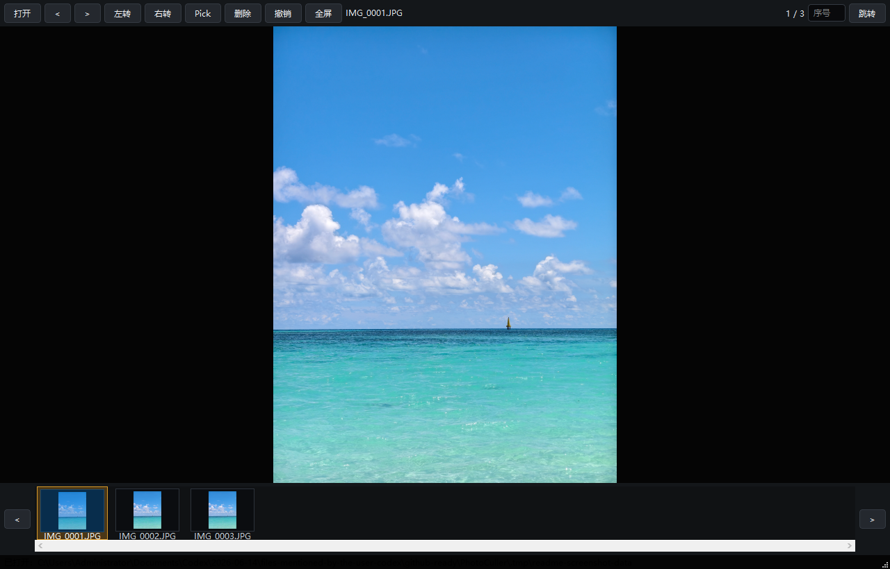

# Photo Culler

Photo Culler is a local Windows photo-culling viewer for folders that contain JPG/JPEG photos and optional same-name Nikon NEF raw files. It is designed for fast field-trip review: browse, pick, delete, zoom, pan, and jump through thumbnails without touching unrelated folders.



## Quick Start

For normal users, download `PhotoCuller-Windows-Portable-v1.0.0.zip` from GitHub Releases, extract it, and run:

```bat
Start_Photo_Culler.cmd
```

Do not launch `Runtime/python.exe` or `Runtime/pythonw.exe` directly.

## Features

- Opens JPG/JPEG files in the selected folder.
- Pairs same-stem `.NEF` files automatically.
- `Pick` copies the current JPG/JPEG and paired NEF to `PICK/`, then advances to the next photo.
- Running `Pick` again on a picked photo cancels the pick and removes the copy recorded by this app.
- `Delete` moves the current JPG/JPEG and paired NEF to `_TRASH/`, then advances to the next photo.
- `Ctrl+Z` undoes the last Pick/Delete operation.
- The thumbnail strip loads dynamically for large folders.
- The main image view renders from the original image for fit preview, zoom, and pan.
- Pressing Next after the last image shows an explicit end marker.
- The portable Windows package works offline and includes its own Python runtime.

## Controls

| Action | Control |
| --- | --- |
| Previous / next | `<` / `>` or arrow keys |
| Pick / cancel Pick | `Enter` or the `Pick` button |
| Delete to `_TRASH/` | `Delete` |
| Undo | `Ctrl+Z` |
| Zoom | Mouse wheel over the image |
| Pan | Left mouse drag on the image |
| Fit to window | Double-click the image or press `0` |
| Jump by index | Enter an index, then click `Jump` |
| Fullscreen | `F` or `F11` |
| Exit fullscreen | `Esc` |

## File Rules

- The app scans only the selected folder, not subfolders.
- Only JPG/JPEG files are displayed.
- Same-stem `.NEF` files are copied or moved together with JPG/JPEG files when present.
- Existing files in `PICK/` or `_TRASH/` are never overwritten; name collisions are auto-renamed.
- State is stored in `.photo-culler-state.json` inside the selected photo folder.

## Screenshot

The screenshot above is captured from the running app with the bundled sample image.

## Development

The source entry point is:

```text
src/photo_culler.py
```

Install dependencies:

```powershell
python -m venv .venv
.\.venv\Scripts\python.exe -m pip install -r requirements.txt
```

Run from source:

```powershell
.\.venv\Scripts\python.exe src\photo_culler.py
```

Run variable tests:

```powershell
.\.venv\Scripts\python.exe tests\test_photo_culler.py
```

Run GUI screenshot tests:

```powershell
.\.venv\Scripts\python.exe tests\capture_gui_original_end.py
.\.venv\Scripts\python.exe tests\capture_gui_zoom_pan.py
```

GUI test screenshots are written to `.tmp/screenshots/`.

## Release

The source repository stays lightweight. Download the Windows portable package from the GitHub Releases page.

## License

No license has been selected yet. Add a `LICENSE` file before publishing if you want others to reuse, modify, or redistribute the code under clear terms.
